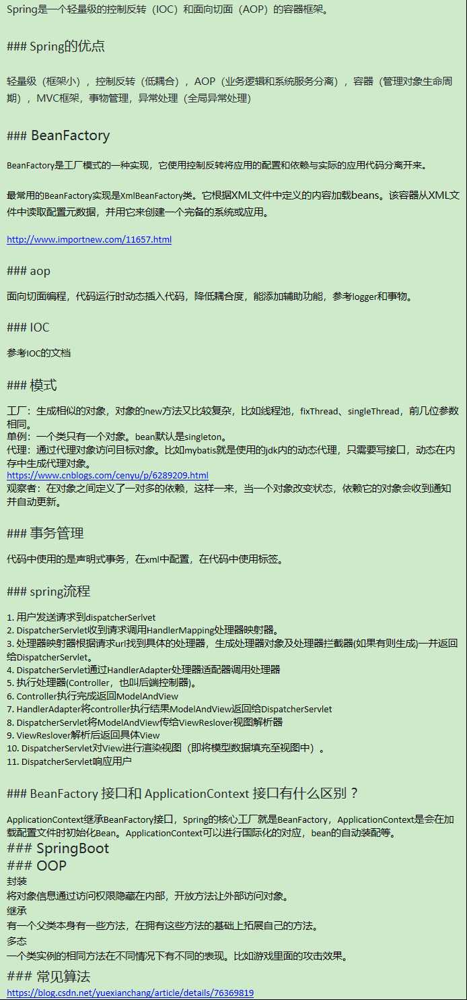

Spring是一个轻量级的控制反转（IOC）和面向切面（AOP）的容器框架。
### Spring的优点
轻量级（框架小），控制反转（低耦合），AOP（业务逻辑和系统服务分离），容器（管理对象生命周期），MVC框架，事物管理，异常处理（全局异常处理）
### BeanFactory
BeanFactory是工厂模式的一种实现，它使用控制反转将应用的配置和依赖与实际的应用代码分离开来。
最常用的BeanFactory实现是XmlBeanFactory类。它根据XML文件中定义的内容加载beans。该容器从XML文件中读取配置元数据，并用它来创建一个完备的系统或应用。
http://www.importnew.com/11657.html
### aop
面向切面编程，代码运行时动态插入代码，降低耦合度，能添加辅助功能，参考logger和事物。
### IOC
参考IOC的文档
### jdbc和Dao
jdbc就是操作数据库sql的java api，他和dao一起保证了与数据库连接代码的整洁，利用aop为Spring对象提供事务管理服务。

### 模式
工厂：生成相似的对象，对象的new方法又比较复杂，比如线程池，fixThread、singleThread，前几位参数相同。还有BeanFactory。
单例：一个类只有一个对象。bean默认是singleton。
代理：通过代理对象访问目标对象。比如mybatis就是使用的jdk内的动态代理，只需要写接口，动态在内存中生成代理对象。
https://www.cnblogs.com/cenyu/p/6289209.html
观察者：在对象之间定义了一对多的依赖，这样一来，当一个对象改变状态，依赖它的对象会收到通知并自动更新。
### 事务管理
代码中使用的是声明式事务，在xml中配置，在代码中使用标签。
### spring流程
1. 用户发送请求到dispatcherSerlvet
2. DispatcherServlet收到请求调用HandlerMapping处理器映射器。
3. 处理器映射器根据请求url找到具体的处理器，生成处理器对象及处理器拦截器(如果有则生成)一并返回给DispatcherServlet。
4. DispatcherServlet通过HandlerAdapter处理器适配器调用处理器
5. 执行处理器(Controller，也叫后端控制器)。
6. Controller执行完成返回ModelAndView
7. HandlerAdapter将controller执行结果ModelAndView返回给DispatcherServlet
8. DispatcherServlet将ModelAndView传给ViewReslover视图解析器
9. ViewReslover解析后返回具体View
10. DispatcherServlet对View进行渲染视图（即将模型数据填充至视图中）。
11. DispatcherServlet响应用户
### BeanFactory 接口和 ApplicationContext 接口有什么区别 ？
ApplicationContext继承BeanFactory接口，Spring的核心工厂就是BeanFactory，ApplicationContext是会在加载配置文件时初始化Bean。ApplicationContext可以进行国际化的对应，bean的自动装配等。
### Spring Bean
Spring Beans是构成Spring应用核心的Java对象。这些对象由Spring IOC容器实例化、组装、管理。这些对象通过容器中配置的元数据创建，例如，使用XML文件中定义的创建。
Spring Bean中定义了所有的配置元数据，这些配置信息告知容器如何创建它，它的生命周期是什么以及它的依赖关系。
### Spring Bean的作用域
在Spring中创建一个bean的时候，通过’scope’属性定义即可。例如，当Spring需要产生每次一个新的bean实例时，应该声明bean的scope属性为prototype。如果每次你希望Spring返回一个实例，应该声明bean的scope属性为singleton，**单例Bean不是线程安全的**。（singleton prototype request session globalsession）
### bean最重要的生命周期？以及如何重写
有两个重要的bean生命周期方法。第一个是setup方法，该方法在容器加载bean的时候被调用。第二个是teardown方法，该方法在bean从容器中移除的时候调用。
bean标签有两个重要的属性(init-method 和 destroy-method)，你可以通过这两个属性定义自己的初始化方法和析构方法。Spring也有相应的注解：@PostConstruct 和 @PreDestroy。
### SpringBoot
### OOP
封装
将对象信息通过访问权限隐藏在内部，开放方法让外部访问对象。
继承
有一个父类本身有一些方法，在拥有这些方法的基础上拓展自己的方法。
多态
一个类实例的相同方法在不同情况下有不同的表现。比如游戏里面的攻击效果。
### 常见算法
https://blog.csdn.net/yuexianchang/article/details/76369819
